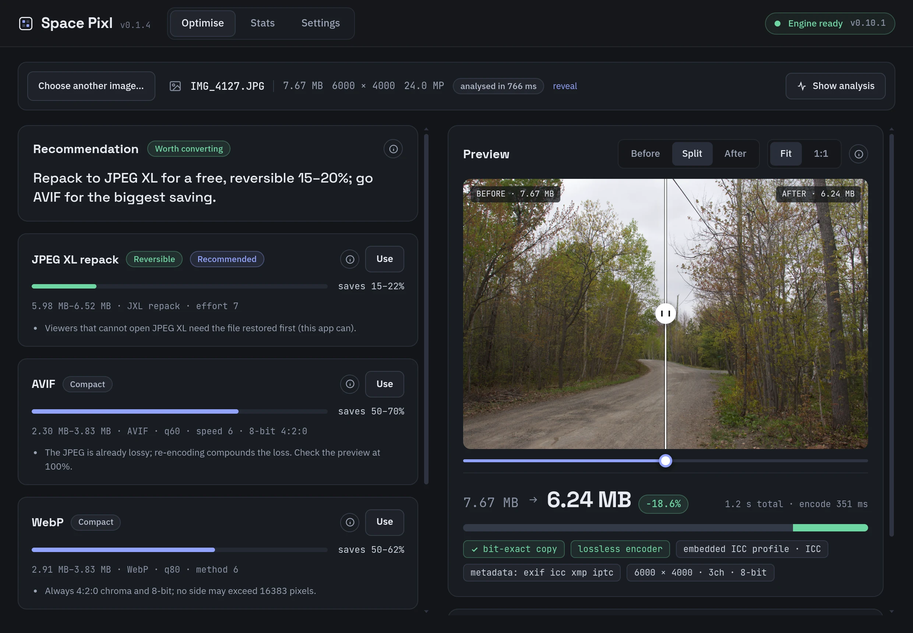
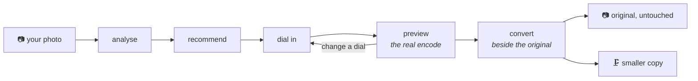
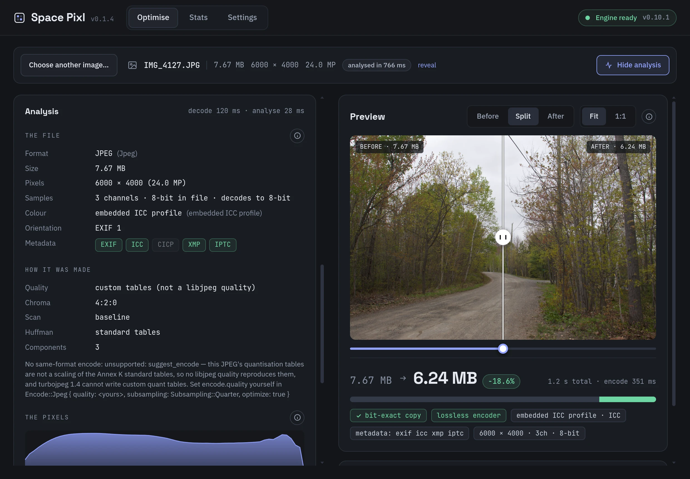
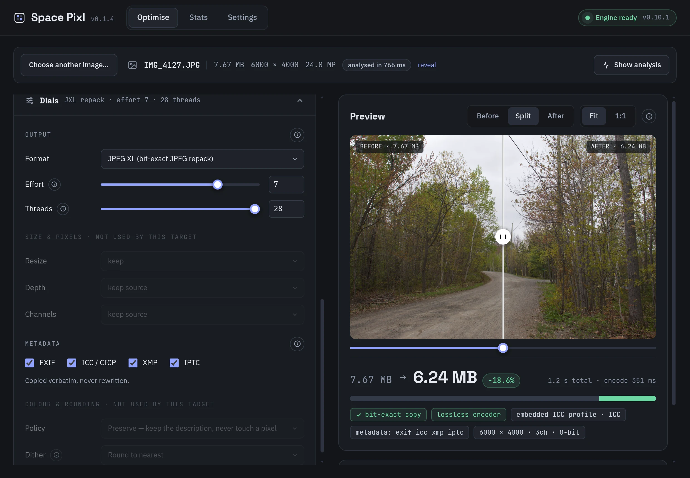
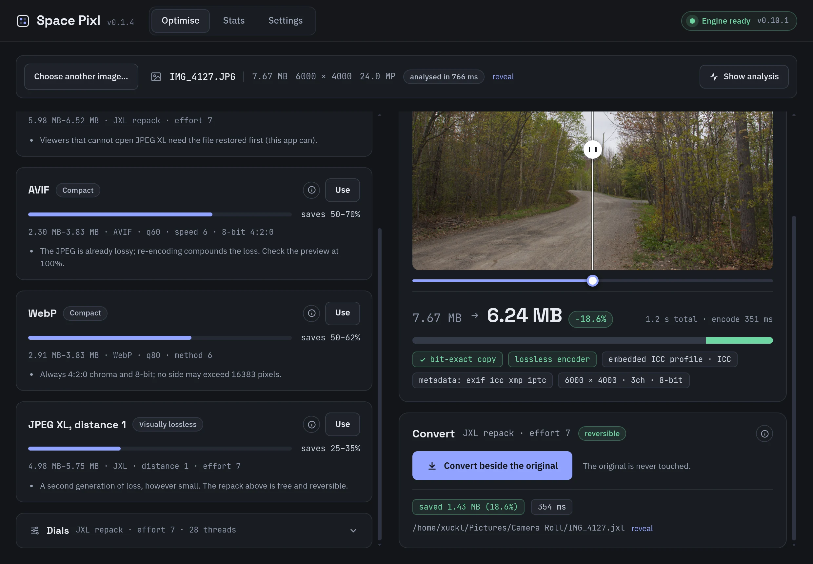
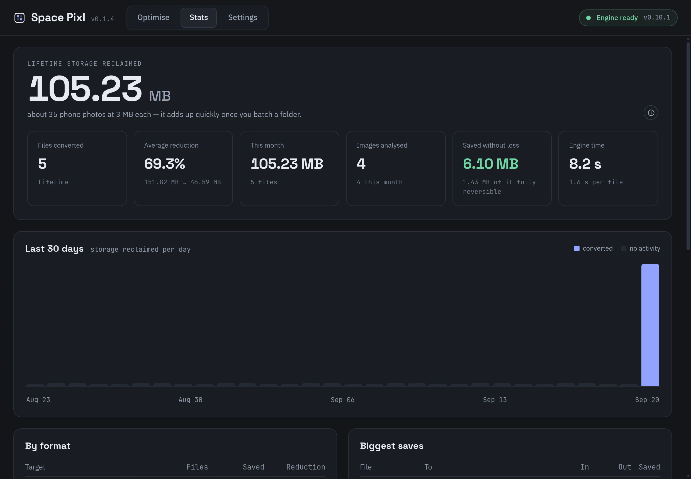
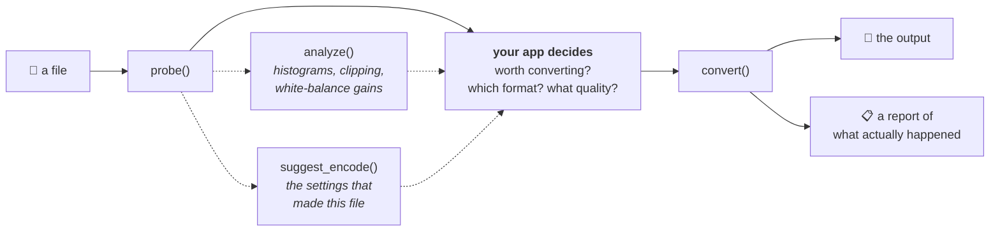

<div align="center">


# Space Pixl

**Reclaim your photo library. Same photos, a fraction of the space.**

[](https://github.com/xuckless/space-pixl/releases/latest)
[](#install)
[](LICENSE)
[](#meet-the-pixl-engine)

<p>
<a href="https://github.com/xuckless/space-pixl/releases/latest/download/space-pixl-mac-arm64.dmg"><b>macOS · Apple Silicon</b></a>
&nbsp;·&nbsp;
<a href="https://github.com/xuckless/space-pixl/releases/latest/download/space-pixl-mac-x64.dmg"><b>macOS · Intel</b></a>
&nbsp;·&nbsp;
<a href="https://github.com/xuckless/space-pixl/releases/latest/download/space-pixl-win-x64-setup.exe"><b>Windows x64</b></a>
</p>

<sub>Builds are unsigned for now; the <a href="#install">install steps</a> take one extra line on macOS.</sub>

<br><br>

<a href="https://xuckless.github.io/space-pixl/">**Interactive tour and savings calculator →**</a>

<br>



</div>

---

Space Pixl looks at each photo, tells you what it can honestly save, previews the **real**
encode before you commit, and writes the result **beside** the original. Nothing is
overwritten. Nothing is guessed.

- **Analyse.** Format, pixels, bit depth, colour profile, metadata, and how the file was encoded in the first place.
- **Recommend.** A verdict and ranked candidates with expected savings taken from measured results.
- **Dial in.** Every encoder knob, resize and resampler, depth and channels, metadata carry-over, colour policy, RAW development, dither.
- **Preview.** Every change re-runs the actual encoder to a temp file. The size shown is the file's size; the "after" image is the file's pixels.
- **Convert.** `IMG_0042.jxl` lands next to `IMG_0042.jpg`. The original is never touched.



---

## In the app

<table>
  <tr>
    <td width="50%"><a href="docs/screenshots/optimise-analysis.webp"></a><br><sub><b>Analysis.</b> What the file is, how it was made, what its pixels look like.</sub></td>
    <td width="50%"><a href="docs/screenshots/optimise-dials.webp"></a><br><sub><b>Dials.</b> The whole converter surface; parts a target does not use are greyed out.</sub></td>
  </tr>
  <tr>
    <td><a href="docs/screenshots/optimise-converted.webp"></a><br><sub><b>Converted.</b> Saved 1.43 MB in 354 ms, written beside the original.</sub></td>
    <td><a href="docs/screenshots/stats.webp"></a><br><sub><b>Stats.</b> Lifetime storage reclaimed, per day, by format, biggest single wins.</sub></td>
  </tr>
</table>

---

## What you save

Measured on the engine's test fixtures on an Apple M2 Pro, release build. Nothing copied
from a datasheet. The same 8.04 MB JPEG, re-encoded every way the engine offers:

| Conversion                                        |        In |      Out |   Change |   Time |
| ------------------------------------------------- | --------: | -------: | -------: | -----: |
| JPEG → **JPEG XL repack** (bit-exact, reversible) |   8.04 MB |  6.55 MB | **−19%** | 0.33 s |
| JPEG → **AVIF** q60                               |   8.04 MB |  2.58 MB | **−68%** | 1.28 s |
| JPEG → WebP q80                                   |   8.04 MB |  3.26 MB |     −59% | 3.44 s |
| JPEG → JPEG XL distance 1 (visually lossless)     |   8.04 MB |  5.53 MB |     −31% | 3.11 s |
| JPEG → HEIC q80                                   |   8.04 MB |  9.66 MB |   _+20%_ |        |
| 16-bit PNG → AVIF 10-bit 4:4:4 q75                | 104.05 MB |  4.92 MB | **−95%** | 2.28 s |
| 16-bit PNG → JPEG XL lossless                     | 104.05 MB | 65.80 MB |     −37% | 9.84 s |
| Canon CR2 → **DNG** (lossless)                    |  35.67 MB | 30.77 MB |     −14% | 0.51 s |
| CR2 → develop → JPEG q92                          |  35.67 MB |  5.40 MB |     −85% | 0.83 s |

Three honest notes, which the app repeats in its own recommendations:

- **The JPEG XL repack is the free lunch.** About 19% off every JPEG in a library, no pixel ever decoded, and the original can be restored byte for byte.
- **AVIF saves the most, HEIC can make files bigger.** Same photo, same "quality 80-ish". The app shows the real size before you commit, so a bad trade is visible, not discovered later.
- **Small PNGs are usually not worth it.** Under about 5 MB the saving rarely pays for a format change, and the app says so.

Try the numbers on your own library size on the [interactive page](https://xuckless.github.io/space-pixl/#savings).

---

## Meet the PIXL engine

> **An image engine that does exactly what you tell it, and tells you exactly what it did.**

PIXL is the part of a photo app that touches pixels. It opens image files, changes them, and
writes them back out: different format, different size, different colours, different look.
It is written in Rust, ships as compiled binaries, and has one rule:

> **PIXL makes no decisions.** You say the format, the size, the quality, the colour space, the
> look. It does that, exactly, and hands you a receipt. If what you asked for is impossible, it
> refuses and names the setting to change. It never quietly does something else instead.

Most image libraries guess: they pick a quality for you, fall back to a different codec when one
fails, drop your transparency to make an encoder happy, or silently re-encode a photo you thought
was being copied. Every one of those guesses is a bug waiting to surface in someone's photo
library. PIXL has no guesses to go wrong, which means the app is the only thing deciding what
happens to your photos, and it can prove what happened, because the engine reports it.

The one thing PIXL is opinionated about is honesty: **it will not write a file whose colour
description disagrees with its pixels.**

### The whole thing is four calls

```
probe(source)                 -> SourceInfo     // what is this file?
analyze(request)              -> ImageStats     // what do its pixels look like?
suggest_encode(info, threads) -> Encode         // how was it encoded?
convert(request)              -> ConvertReport  // do the work
```



The dashed calls exist so an app can decide _well_. The solid path is the work. Note where the
thinking happens: in the middle box, which is the app's. In Space Pixl that box is the
recommendation layer you see on screen.

### Capabilities

|                     |                                                                                                                                             |
| ------------------- | ------------------------------------------------------------------------------------------------------------------------------------------- |
| **Reads**           | JPEG · PNG · HEIF / HEIC / AVIF · JPEG XL · TIFF · WebP · RAW                                                                               |
| **Writes**          | JPEG · PNG · AVIF · JPEG XL · TIFF · WebP · DNG                                                                                             |
| **Resize**          | nearest, bilinear, Catmull-Rom, Lanczos3, or a super-resolution model the app supplies; optional linear-light resampling                    |
| **Pixels**          | explicit bit depth and channel control; rounded once, and the report says so; dither on request                                             |
| **Colour**          | resolved in a stated order (embedded ICC → CICP → format default), then one of four named policies: Preserve · Assign · ConvertTo · ToneMap |
| **RAW**             | developed in linear light, developed with the sRGB curve, or read from the camera's embedded preview; RAW → DNG lossless                    |
| **HDR**             | PQ and HLG survive into HDR-capable sinks untouched; HDR → SDR is refused until a tone-map operator and both peaks are named                |
| **Metadata**        | EXIF, ICC, XMP, IPTC copied verbatim across container boundaries, never rewritten                                                           |
| **Bit-exact paths** | JPEG → JPEG XL repack (~19% smaller, reversible) and same-format copy                                                                       |
| **Analysis**        | per-channel histograms, clipping percentages, grey-world gains: the numbers an "Auto" button is made of, without the decision               |
| **Errors**          | name the field to change; nothing falls back to a second-best path                                                                          |
| **Bindings**        | one Rust interface, out to Swift, Kotlin and Node; Space Pixl runs the Node binding in an Electron utility process                          |

<details>
<summary><b>What PIXL will never do for you</b></summary>

This list is the feature, not a disclaimer. Every item is a judgement call that belongs to the
app that knows its users:

- Route by file extension, or re-sniff a file you already told it about
- Decide a quality, an effort level or a codec
- Decide whether a conversion is _worth it_ (it isn't always; see the table above)
- Pick a tone-mapping operator or invent a mastering peak
- Press "Auto"
- Batch, thread-pool, report progress, or support cancellation (the app does)
- Fall back to a second-best path when the first fails
- Clamp anything to what it guesses your device can handle
- Drop your alpha channel or halve your bit depth to make a request succeed

</details>

<details>
<summary><b>Colour, in detail</b></summary>

- **Resolution order:** embedded ICC profile → CICP code points → the format's own default. The report says which one won.
- **Preserve** keeps the description and never touches a pixel. **Assign** relabels pixels with a colour space you assert. **ConvertTo** converts them through Little CMS into a named space. **ToneMap** brings HDR down to SDR with an operator and peaks you name.
- **Linear-light resampling** is opt-in: resizing in gamma space darkens fine detail and haloes hard edges; this fixes both at the cost of an `f32` round trip.
- **Grading** (white balance, exposure, curves, HSL, LUTs, noise reduction) is part of the engine and deliberately _absent_ from Space Pixl. It belongs to a different app. See below.

</details>

<details>
<summary><b>What it is built on</b></summary>

| Job                | Library                                                     |
| ------------------ | ----------------------------------------------------------- |
| JPEG               | libjpeg-turbo (SIMD, built from vendored source)            |
| PNG                | the `png` crate, native depth and colour type preserved     |
| HEIF / HEIC / AVIF | libheif + aom, 8/10/12-bit                                  |
| JPEG XL            | an in-house wrapper over libjxl                             |
| TIFF               | the `tiff` crate in, rawler's writer out                    |
| WebP               | libwebp                                                     |
| RAW + DNG          | rawler (the DNGLab writer)                                  |
| Colour management  | Little CMS, vendored                                        |
| Resampling         | fast_image_resize (SIMD, 8- and 16-bit)                     |
| Upscaling          | ONNX Runtime, loaded dynamically, model supplied by the app |

</details>

---

## Space Pixl is one way to use the engine

A storage optimiser needs `probe`, `analyze`, `suggest_encode` and a `convert` with the encoder
dials. It never touches the engine's other half: an ordered list of **grading stages**, each an
ordered list of operations in a colour space you name. White balance and exposure in linear light
where they belong; curves and HSL where the eye lives; ASC CDL for anyone coming from film; `.cube`
LUTs at any strength; noise reduction with detail sliders; presets as plain JSON.

### 🎞️ Coming next: PIXL Playroom

**A Lightroom alternative, built on the same honest engine.** Sliders, looks and presets. RAW
developed properly. HDR delivered on purpose. Every edit is a named operation in a named colour
space, and every export comes with a receipt of what actually happened to the pixels.

No date yet. Watch this repository for the announcement.

---

## Install

Installers are attached to every [GitHub release](https://github.com/xuckless/space-pixl/releases).
The app checks for updates on launch and every four hours.

> [!IMPORTANT]
> Builds are **not yet code-signed**. macOS will say the app is _"damaged and can't be opened"_
> and Windows SmartScreen will warn. Both are the standard notices for an unsigned download; the
> steps below get past them. Signed builds are planned.

<details open>
<summary><b>macOS 13+</b></summary>

1. Download the disk image for your Mac. Not sure which? → About This Mac → Chip.
   - [**Apple Silicon**](https://github.com/xuckless/space-pixl/releases/latest/download/space-pixl-mac-arm64.dmg) (M1 or newer)
   - [**Intel**](https://github.com/xuckless/space-pixl/releases/latest/download/space-pixl-mac-x64.dmg)
2. Open the `.dmg` and drag **Space Pixl** to **Applications**.
3. Clear the quarantine flag once (this is what the "damaged" dialog is about). In Terminal:

   ```sh
   xattr -dr com.apple.quarantine "/Applications/Space Pixl.app"
   ```

4. Open Space Pixl from Applications.

Until builds are signed, macOS cannot install updates in place: download the new `.dmg` from
the releases page and repeat step 3.

</details>

<details open>
<summary><b>Windows 10 / 11, 64-bit</b></summary>

1. Download the [**installer**](https://github.com/xuckless/space-pixl/releases/latest/download/space-pixl-win-x64-setup.exe) (`space-pixl-win-x64-setup.exe`).
2. Run it. It installs per user, with no admin prompt. If SmartScreen appears, click **More info**, then **Run anyway**.
3. Space Pixl opens when the installer finishes and updates itself in the background from then on.

</details>

Linux is not shipped.

---

## Source

This repository is public so the app can be read: how a recommendation is made, what a dial
does, what is written to disk. It cannot be built from here. The PIXL engine is a private,
compiled component distributed only as binaries to the app's own build pipeline, and the app does
nothing without it.

<sub>Copyright © 2026 xuckless. All rights reserved. The source is published for reference only;
see [LICENSE](LICENSE). The PIXL engine is a separate, closed component and is not made available
through this repository.</sub>
